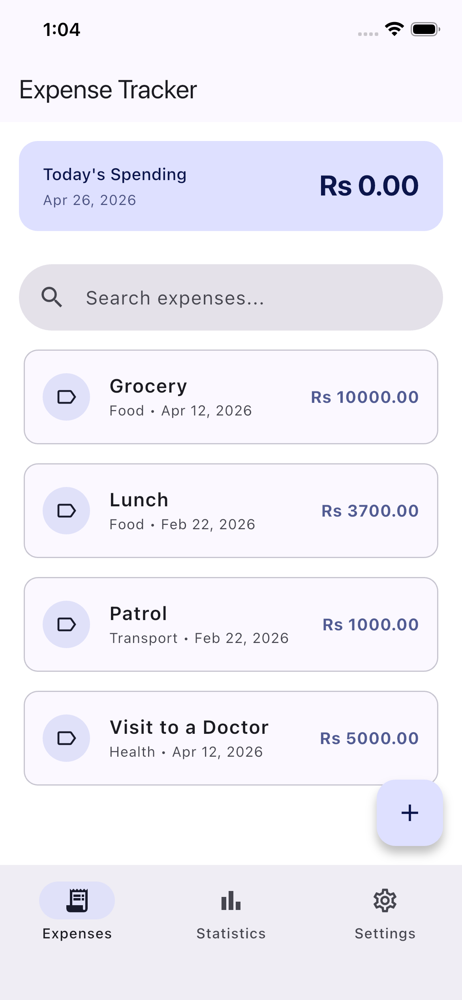
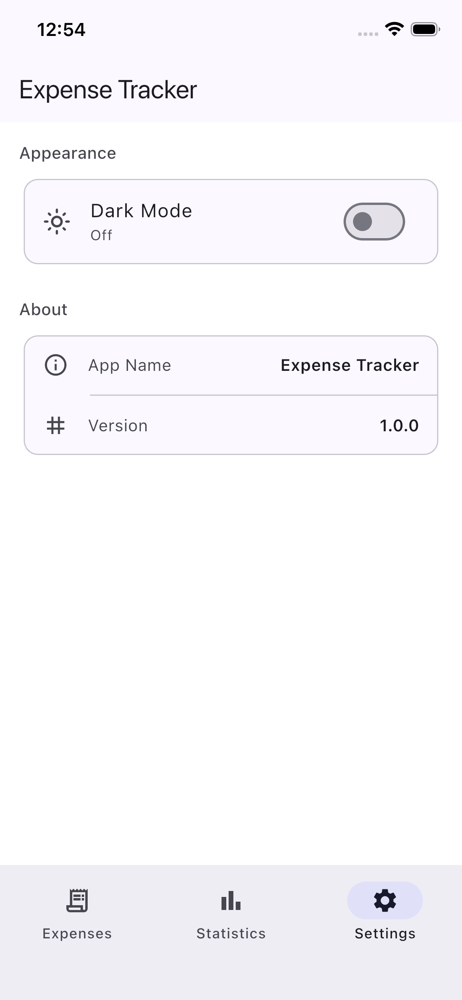
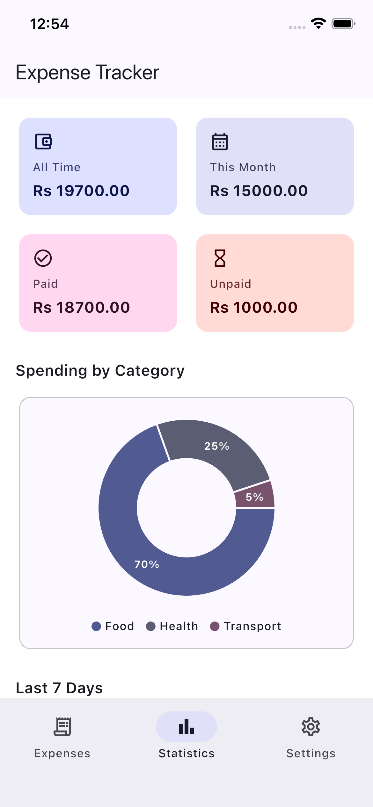
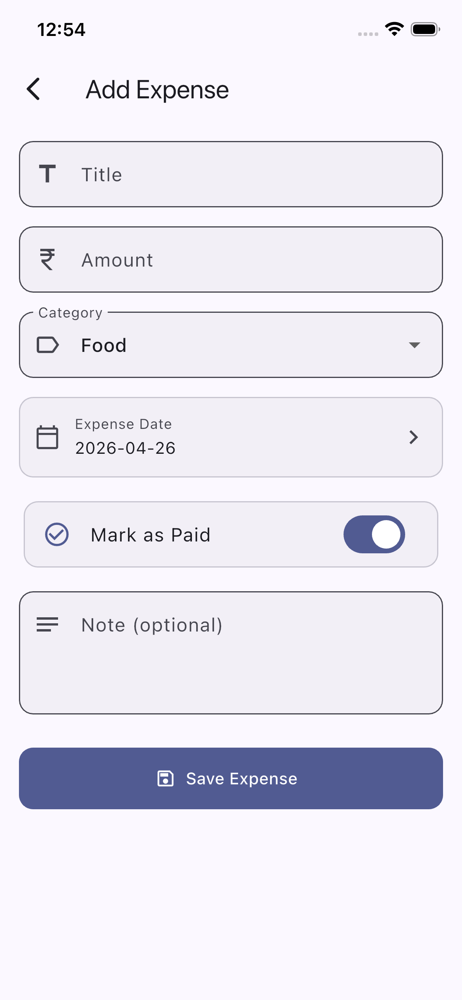
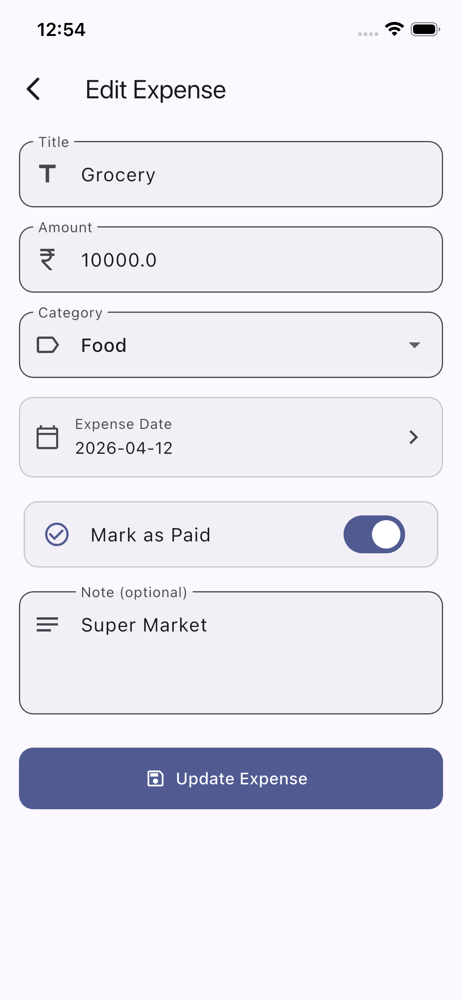
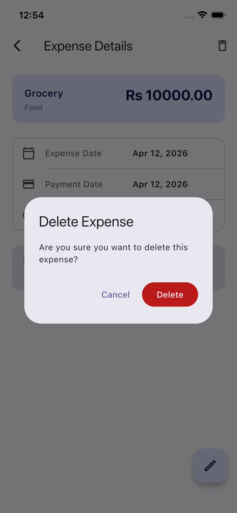
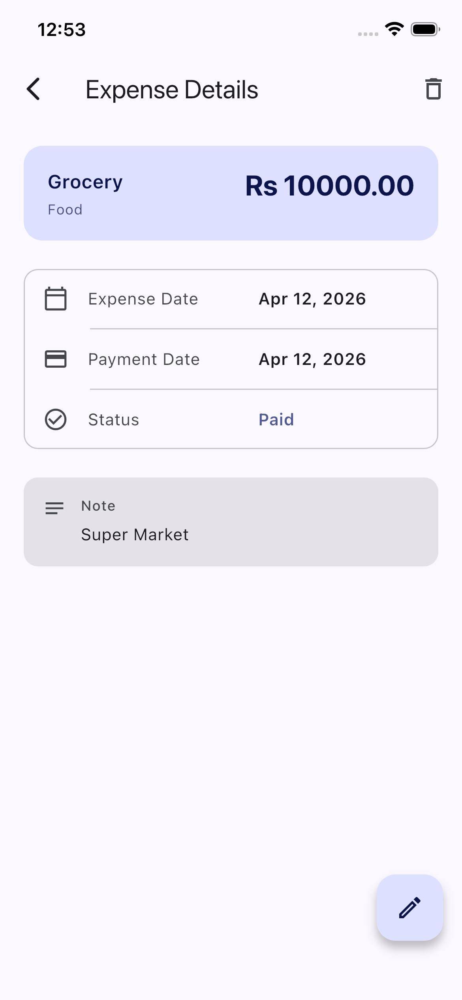
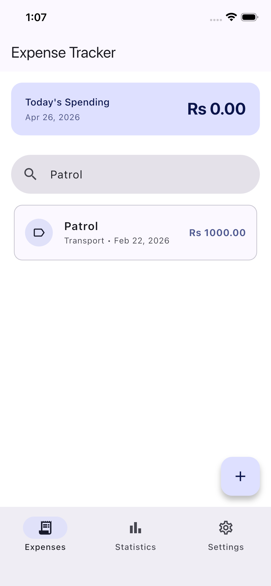

# 💰 Expense Tracker

A simple and clean Flutter app to manage your daily expenses, track spending, and stay in control of your finances.

---

## ✨ Features

- ➕ Add and manage expenses easily
- 🗑️ Delete entries with one tap
- ✏️ Edit existing transactions
- 📊 View detailed stats and insights
- ⚙️ Customizable settings
- 📱 Clean and minimal UI

---

## 📸 Screenshots

<p align="center">
    
 
  
 
</p>

<p align="center">
  
  
  
 
 
</p>

---

## 🚀 Getting Started

Clone the repository:

```bash
git clone https://github.com/your-username/expense_tracker.git
cd expense_tracker